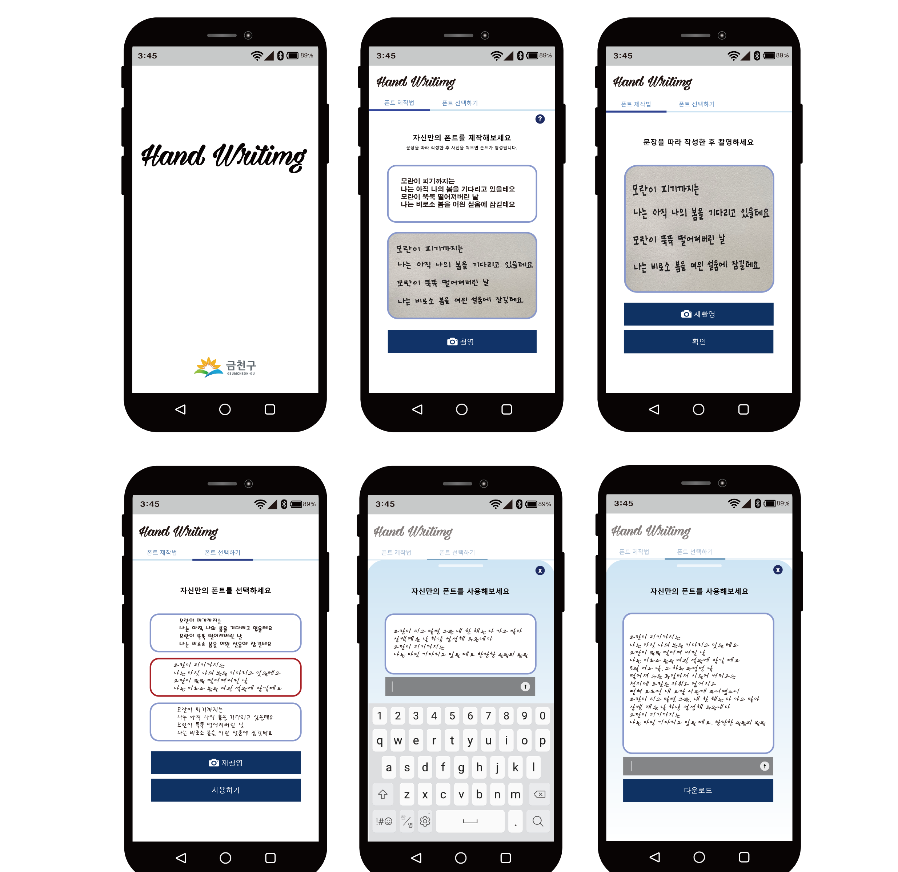

# Hand Writing
본 프로젝트는 Flutter로 개발 되었습니다.

## 사용 방법

1. 화면에 나타난 문장을 따라 작성 후 해당 이미지 촬영
2. 촬영 된 이미지 확인 후 확인 버튼을 눌러 폰트 선택창으로 이동
3. 생성 된 폰트 중 원하는 폰트를 선택 후 사용하기 누르기
4. 선택된 폰트 사용 및 다운로드

## Getting Started

This project is a starting point for a Flutter application.

A few resources to get you started if this is your first Flutter project:

- [Lab: Write your first Flutter app](https://docs.flutter.dev/get-started/codelab)
- [Cookbook: Useful Flutter samples](https://docs.flutter.dev/cookbook)

For help getting started with Flutter development, view the
[online documentation](https://docs.flutter.dev/), which offers tutorials,
samples, guidance on mobile development, and a full API reference.
